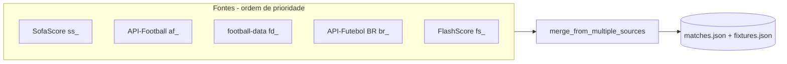

# Integrar API-Football e API-Futebol BR

## Arquitetura após a integração




---

## 1. Coletor API-Football

**Arquivo:** [collectors/api_football.py](collectors/api_football.py) (novo)

- **Base:** `https://v3.football.api-sports.io`
- **Auth:** Header `x-apisports-key: {API_FOOTBALL_KEY}`
- **Rate limit:** 100 req/dia (free) — usar `time.sleep(1)` entre requests

**League IDs:** 39 (PL), 140 (PD), 78 (BL1), 135 (SA), 61 (FL1), 2 (CL), 71 (BSA), 13 (LIB), 11 (SUA)

**Endpoints:**

- Matches: `GET /fixtures` com `league={id}&season={ano}&last=30`
- Fixtures: `GET /fixtures` com `league={id}&season={ano}&next=10`

**Normalização:**

- ID: `af`_ + `fixture.id`
- Status: mapear NS→SCHEDULED, 1H/HT/2H/ET/P→LIVE, FT/AET/PEN→FINISHED, PST/CANC/ABD→POSTPONED
- Campos: `teams.home/away`, `goals`, `fixture.date`, `league`

**Tratamento de erros:** retries (3x), timeout 15s, log `[api-football] WARN: ...` em falhas

---

## 2. Coletor API-Futebol BR

**Arquivo:** [collectors/api_futebol_br.py](collectors/api_futebol_br.py) (novo)

- **Base:** `https://api.api-futebol.com.br/v1`
- **Auth:** Header `Authorization: Bearer {API_FUTEBOL_BR_KEY}`

**Campeonato IDs:** 10 (BSA), 11 (Série B), 244 (Copa do Brasil), 152 (Libertadores), 153 (Sul-Americana)

**Estratégia de coleta:**

- `GET /campeonatos/{id}/rodadas` para listar rodadas
- Para cada rodada: `GET /campeonatos/{id}/rodadas/{num}` e extrair `partidas[]`
- Filtrar partidas por `date_from` e `date_to` (ISO)
- Para fixtures: rodadas com `status=agendado` ou data futura

**Normalização:**

- ID: `br`_ + `partida_id`
- Data: juntar `data_realizacao` + `hora_realizacao` → ISO 8601 em UTC (assumir -03:00 Brasil)
- Status: agendado→SCHEDULED, ao_vivo/intervalo→LIVE, encerrado→FINISHED, cancelado/adiado→POSTPONED
- Crests: `time_mandante.escudo`, `time_visitante.escudo`

---

## 3. Config ([config.py](config.py))

- `API_FOOTBALL_KEY` e `API_FOOTBALL_ENABLED` (default false)
- `API_FUTEBOL_BR_KEY` e `API_FUTEBOL_BR_ENABLED` (default false)
- `FIXTURE_WINDOW_DAYS` (default 7) — para janela de fixtures
- Manter `METRICS_WINDOW_DAYS` (60) para matches

---

## 4. main.py — ordem de coleta e merge

**Ordem de prioridade (prompt):** SofaScore > API-Football > football-data > API-Futebol BR > FlashScore

**Matches e fixtures:**

```python
# Ordem: ss, af, fd, br, fs
if SOFASCORE_ENABLED: match_sources.append(sofascore.fetch_matches(...))
if API_FOOTBALL_ENABLED: match_sources.append(api_football.fetch_matches(...))
if FOOTBALL_DATA_API_KEY: match_sources.append(fd_normalized)
if API_FUTEBOL_BR_ENABLED: match_sources.append(api_futebol_br.fetch_matches(...))
if FLASHSCORE_ENABLED: match_sources.append(flashscore.fetch_matches(...))
```

- Usar `FIXTURE_WINDOW_DAYS` para `fixture_to` (em vez de 2 dias fixos)
- Fallback: se `match_sources` vazio após todas as fontes, logar WARNING e usar `load_matches()` (já carrega seed)

---

## 5. storage.py — melhorias

**a) Merge com enriquecimento:**

- Quando a mesma chave aparece em fontes diferentes: manter registro de maior prioridade
- Exceções: copiar `home_team_crest`/`away_team_crest` se o vencedor não tiver e a outra fonte tiver
- Copiar `home_goals`/`away_goals`/`total_goals` se vencedor tiver null e a outra tiver valor
- Nunca sobrescrever `status=FINISHED` por `SCHEDULED`

**b) Escrita atômica:**

- Em `save_matches`: escrever em `matches.json.tmp`, depois `os.replace(tmp, final)` (ou `os.rename` em Windows)
- Mesmo para `_save_fixtures` em main.py (ou extrair para storage e fazer atômico lá)

**c) Validação antes de salvar (opcional nesta fase):**

- Garantir `id` não vazio, `date` ISO válido, `status` em {SCHEDULED, LIVE, FINISHED, POSTPONED}

---

## 6. football_data.py — ajustes de conformidade

- Prefixo de ID: `fd`_ + `match.id` (hoje retorna só o número)
- STATUS_MAP: mapear SCHEDULED, TIMED→SCHEDULED, IN_PLAY, PAUSED→LIVE, FINISHED→FINISHED, SUSPENDED, POSTPONED, CANCELLED→POSTPONED
- Nomes: usar `name` em vez de `shortName` (prompt: "nomes por extenso")

---

## 7. .env.example

```
API_FOOTBALL_KEY=
API_FUTEBOL_BR_KEY=
API_FOOTBALL_ENABLED=false
API_FUTEBOL_BR_ENABLED=false
MATCH_WINDOW_DAYS=30
FIXTURE_WINDOW_DAYS=7
```

---

## 8. API-Futebol BR — detalhe de endpoints

A API não expõe diretamente "últimos N dias". Abordagem:

- `GET /campeonatos/{id}` — metadados do campeonato
- `GET /campeonatos/{id}/rodadas` — lista de rodadas com datas
- Para cada rodada relevante: `GET /campeonatos/{id}/rodadas/{numero}` → `partidas`
- Filtrar partidas por `date_from` ≤ `data_realizacao` ≤ `date_to`

Se `/rodadas` não existir, usar `GET /campeonatos/{id}/rodadas/atual` e rodadas adjacentes (atual-1, atual, atual+1, etc.).

---

## Ordem de implementação

1. config.py — variáveis e flags das novas APIs
2. collectors/api_football.py — coletor completo
3. collectors/api_futebol_br.py — coletor completo (com fallback se API diferir)
4. storage.py — merge com enriquecimento + escrita atômica
5. football_data.py — prefixo fd_ e STATUS_MAP
6. main.py — integrar api_football e api_futebol_br na ordem correta
7. .env.example — novas variáveis

